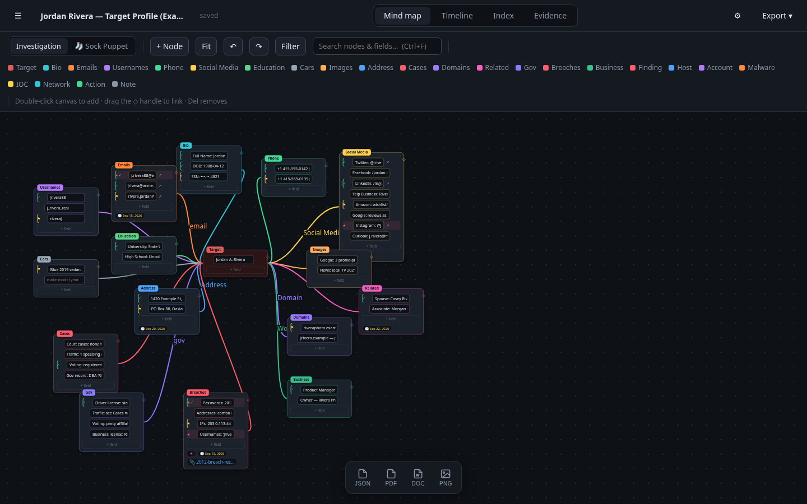

# Dossier

A local, offline mind-map + timeline tool for infosec incident investigations.

Investigate an incident on a visual canvas, hang evidence files off the nodes,
and get a chronological timeline built automatically from what you record.

Everything stays on your machine — there is no cloud, no telemetry, no external
calls. Each case is a self-contained folder you can zip up and hand to someone.

> ⚠️ **Not a production application.** Dossier is a local tool for a trusted
> analyst on a machine they control. It has **not** been security-hardened or
> audited for untrusted networks, multi-tenant hosting, or public/internet-facing
> use. Run it **only on a secure, access-controlled host** — it binds to
> `127.0.0.1` by design; never expose it to the internet or an untrusted network.



## Features

- **Mind map** — build *container nodes* with a title, a colour-coded **category**,
  and editable **fields** inside them. Link nodes (or individual fields) with
  labelled connections; pan, zoom, fit, undo/redo, filter, and search.
- **Investigation templates** — start a case from a ready-made layout: Target
  profile (OSINT), Company due diligence (M&A), Executive privacy, ORM (person
  or company), OSINT reporting, or blank. Customize any template, save it as your
  default, and export/import your whole template set.
- **Two maps per case** — the **Investigation** map (which feeds the timeline and
  index) plus a separate **Sock Puppet** workflow map for recording how accounts
  were created.
- **Flags / triage** — mark fields or nodes **Important**, **Follow-up**,
  **Verified**, or **Not verified**, and add your own custom flags.
- **Timeline** — give a node a date and it appears automatically; add standalone
  events too. View it as a grouped list or a graphic, and edit per-node notes
  here. Items cross-link back to their node on the map.
- **Index** — every field value aggregated and grouped by category, detected type
  (email, domain, IP, handle, URL, phone…), or flag.
- **Evidence** — upload screenshots, logs, PCAPs, reports. Files are *copied into
  the case* and hashed (SHA-256). Link a file to any node; images open in a
  lightbox. Up to 512 MB per file.
- **Case management** — a dashboard with search, sort, inline editing, and case
  metadata (number, analyst, TLP classification, summary).
- **Accounts, roles & access** — multi-user sign-in (admin / analyst), per-case
  **owner** and **assignees**, with access enforced on the server.
- **Security** — **at-rest encryption** (AES-GCM, with the key wrapped per user
  from their password), login lockout, idle auto-lock, bounded sessions, and a
  **tamper-evident, hash-chained audit trail**.
- **Snapshots & safety** — point-in-time case versions with safe restore, plus
  optimistic-concurrency conflict detection for concurrent edits.
- **Exports** — a formatted case report (**PDF** or **Word**) with the map image,
  graphic timeline, and metadata header; plus **JSON**, map **PNG**, and a full
  **`.zip`** bundle (including evidence) that re-imports anywhere.
- **Portable & offline** — one self-contained folder per case; no cloud, no
  telemetry, no external calls. Edits **autosave** to disk.

## Install & run

See **[INSTALL.md](INSTALL.md)** for full instructions — Linux, macOS, and
Windows, virtual environments, where data is stored, updating, and
troubleshooting.

Quick version:

```bash
pip install -r requirements.txt
python3 app.py
```

Then open <http://127.0.0.1:6854> in a browser and sign in with the default
credentials **`admin`** / **`admin`** — then change the password right away.
(See [INSTALL.md](INSTALL.md#5-sign-in-default-credentials) for details and how
to start from a blank vault instead.)

Data is written next to `app.py` (under `./cases/`, or wherever you point
`DOSSIER_DATA`). Back that folder up and you've backed up every investigation.

## Documentation

- **[INSTALL.md](INSTALL.md)** — install and run (Linux/macOS/Windows).
- **[USER_GUIDE.md](USER_GUIDE.md)** — using Dossier: cases, the mind map,
  flags, timeline, index, evidence, and exports.
- **[ADMIN_GUIDE.md](ADMIN_GUIDE.md)** — users & roles, encryption, case access,
  the audit trail, and backups.

## Quick start

1. Sign in with the default admin account — **`admin`** / **`admin`** — and
   change the password immediately. (Or start from a blank vault; see
   [INSTALL.md](INSTALL.md#5-sign-in-default-credentials).)
2. Click **＋ New case**, name it (e.g. `RANSOM-2026-014`), pick a **Start from**
   template, and **Create case**.
3. Double-click the canvas (or **+ Node**) to add a node; set its category and
   type values into its fields. Add a **date** in the node menu to put it on the
   timeline.
4. Drag the `◇` handle on a node onto another node to link them.
5. Go to the **Evidence** tab, upload a file, then link it from a node's menu
   (right-hand drawer).
6. Open the **Timeline** tab to see everything with a date laid out in order, and
   add per-node notes there. Click a node tag to jump back to it on the map.

See the **[User Guide](USER_GUIDE.md)** for the full walkthrough.

**A fictional demo case ships with the app** — the Target Profile shown above.
After you create your account it appears on the dashboard automatically, ready to
click around in. (All its data is invented; delete it anytime.)

## Keyboard

- `Double-click` canvas — new node
- `Del` / `Backspace` — delete the selected node or edge
- `Esc` — deselect / close inspector
- Mouse wheel — zoom · drag canvas — pan · drag node — move

## Data model (`case.json`)

Each case lives in `cases/<id>/` as `case.json` alongside `evidence/` and
`snapshots/`. A case holds two maps; the **investigation** map is the one the
timeline and index read from.

```jsonc
{
  "schema": 1,
  "name": "RANSOM-2026-014",
  "rev": 7,                       // bumped on every save (concurrency control)
  "created": "...", "modified": "...",
  "owner": "alice",               // access control
  "assignees": ["bob"],
  "meta": {                       // shown on the dashboard and in reports
    "caseNumber": "INV-2026-014",
    "analyst": "alice",
    "classification": "TLP:AMBER",
    "summary": "..."
  },
  "activeMap": "investigation",
  "maps": {
    "investigation": {
      "nodes": [ { "id", "type", "title", "x", "y",
                   "rows":  [ { "id", "text", "url", "flags": [] } ],
                   "notes", "timestamp", "flags": [],
                   "evidence": ["<evidence-id>"] } ],
      "edges": [ { "id", "from", "to", "fromRow", "toRow", "label" } ],
      "view":  { "x", "y", "scale" }
    },
    "sockpuppet": { "nodes": [], "edges": [], "view": {} }
  },
  "events":   [ { "id", "timestamp", "title", "notes", "nodeId" } ],
  "evidence": [ { "id", "stored", "filename", "size", "sha256", "uploaded" } ],
  "customCategories": [], "customFlags": []   // definitions embedded for portability
}
```

> When at-rest encryption is enabled, the stored `case.json`, snapshots, and
> evidence files are AES-GCM ciphertext prefixed with a `TMENC1` marker; the shape
> above is the decrypted form. Exports are always decrypted.

## Tests

```bash
pip3 install -r requirements-dev.txt
pytest -q
```

The suite (`test_app.py`) runs the API against an **isolated temp data dir**
(via the `DOSSIER_DATA` env var) so it never touches your real `cases/`. It
covers auth + lockout, roles & per-case access, optimistic-concurrency conflict
detection, at-rest encryption round-trips, the tamper-evident audit chain,
password change/reset, and snapshots.

To relocate live data, set `DOSSIER_DATA=/path/to/data python3 app.py`.

## Notes

- The server binds to `127.0.0.1` only. It has its own sign-in, roles, and
  at-rest encryption, but it is **not** hardened for network exposure — don't put
  it behind a public reverse proxy without adding your own TLS and access controls.
- Upload size cap is 512 MB per file (see `MAX_CONTENT_LENGTH` in `app.py`).
- There is **no vault recovery** — if every account password is lost, encrypted
  data cannot be decrypted. See the [Admin Guide](ADMIN_GUIDE.md#encryption-model).
